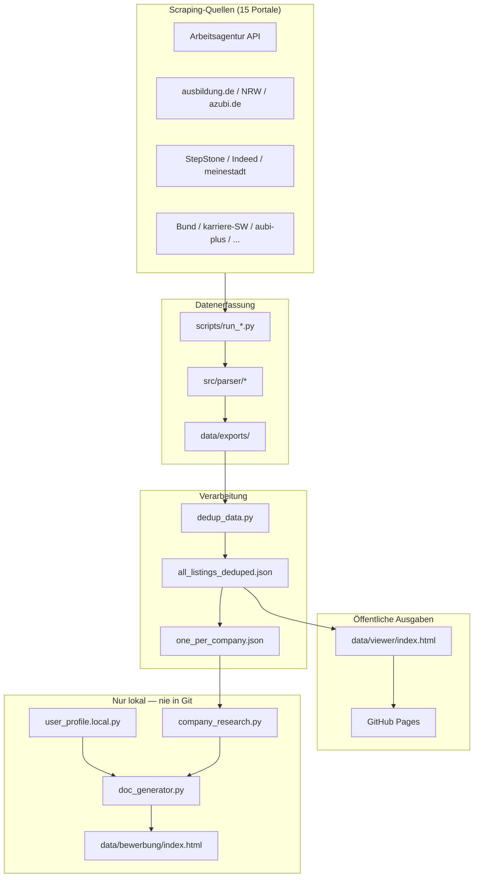
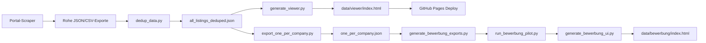

# AusbildungHunter Intelligence

[](https://www.python.org/downloads/)
[](#aktuelle-statistiken)
[](#aktuelle-statistiken)
[](LICENSE)
[](https://acimdamero.github.io/ausbildung-scraper/)

> **Tagline:** Multi-Portal FI-Ausbildungssuche, Deduplizierung und intelligente Bewerbungsgenerierung.

| Sprache | README |
|---------|--------|
| English | [README.md](README.md) |
| Bahasa Indonesia | [README.id.md](README.id.md) |

---

## Was dieses Projekt leistet

**Problem:** Ausbildungsstellen für *Fachinformatiker/in Anwendungsentwicklung* (FI-AE) sind über 15+ Jobportale verstreut. Manuelle Suche ist zeitaufwendig, Duplikate häufen sich, und personalisierte Bewerbungen für Hunderte von Unternehmen sind überwältigend.

**Lösung:** **AusbildungHunter Intelligence** (AHI) ist eine End-to-End-Pipeline, die:

1. **15 deutsche Portale** scraped (REST-API + Playwright)
2. **Stellen normalisiert** in ein einheitliches Datenmodell (`AusbildungListing`)
3. **Quellenübergreifend dedupliziert** (~6.850 eindeutige Stellen)
4. **Einen durchsuchbaren HTML-Viewer** auf GitHub Pages veröffentlicht
5. **Personalisierte Bewerbungsunterlagen lokal generiert** (DE + ID) — niemals hochgeladen

Drei Module, eine Codebasis:

| Modul | Zweck |
|-------|-------|
| **Ausbildung Intelligence** | Stellen aus allen Portalen sammeln, deduplizieren und durchsuchen |
| **FI-Ausbildung Hunter** | Fokus auf *Fachinformatiker/in Anwendungsentwicklung* und verwandte FI-Profile |
| **Bewerbung Engine** | Firmenrecherche + Anschreiben, Motivationsschreiben, E-Mail-Entwürfe (nur lokal) |

---

## Aktuelle Statistiken

| Kennzahl | Wert | Quelldatei |
|----------|------|------------|
| Deduplizierte Stellen | **6.850** | `data/processed/all_listings_deduped.json` |
| Eindeutige Unternehmen | **3.895** | `data/processed/one_per_company.json` |
| Aktive Portale | **15** | Siehe [Scraping-Quellen](#scraping-quellen) |
| FI-Kategorien | AE, AE 2026, DPA | `config/categories.yaml` |

Größte Quellen nach deduplizierter Anzahl: ausbildungsstellen.de (2.647), Arbeitsagentur (1.107), meine-ausbildung (745), azubi.de (645), StepStone (576).

---

## Highlights

| Funktion | Beschreibung |
|----------|--------------|
| Multi-Portal-Scraping | Arbeitsagentur-API + 14 browserbasierte Portale |
| Intelligente Deduplizierung | Quellenübergreifend nach Referenznummer und Hash |
| Durchsuchbarer Viewer | Filter nach Stadt, Firma, Portal, Kategorie — reines HTML, kein Backend |
| One-per-Company | Beste Stelle pro Unternehmen für effiziente Bewerbungen |
| Bewerbung Intelligence | Firmenrecherche, Anschreiben, Motivationsschreiben, E-Mail-Entwürfe (DE + ID) |
| Datenschutz zuerst | Bewerberprofil und Briefe bleiben lokal — nie in Git |

---

## Technologie-Stack

[](https://www.python.org/downloads/)
[](https://playwright.dev/)
[](https://requests.readthedocs.io/)
[](.github/workflows/pages.yml)
[](https://acimdamero.github.io/ausbildung-scraper/)
[](config/categories.yaml)

| Kategorie | Technologien |
|-----------|--------------|
| **Sprachen** | Python 3.10+, HTML5, CSS3, Vanilla JavaScript |
| **Backend & Scraping** | `requests` (Arbeitsagentur REST-API + Firmenrecherche), Playwright/Chromium (14 dynamische Portale), `ThreadPoolExecutor` für parallele API-Abfragen |
| **Parsing & Konfiguration** | JSON / JSON-LD, Regex-HTML-Extraktion, `pyyaml` (`config/categories.yaml`, `fields_mapping.yaml`), `python-dotenv` |
| **Daten-Pipeline** | JSON- & CSV-I/O, quellenübergreifende Dedup (`src/storage/dedup.py`), One-per-Company-Export, Fortschritts-Tracking, optional `gspread` → Google Sheets |
| **Frontend** | Eigenständiger HTML-Viewer (`data/viewer/`), intelligente Suche mit Autovervollständigung, eingebettetes JSON (ohne Backend), Dark-Theme-CSS, `localStorage`-Status (Bewerbungs-UI) |
| **Bewerbung Intelligence** | `company_research.py`, `contact_extractor.py`, `doc_generator.py` (DE + ID), `user_profile.local.py`, mailto-Helfer — alles nur lokal |
| **DevOps & Tooling** | Git, Bash-Pipeline-Skripte (`run_background_pipeline.sh`), GitHub Actions → GitHub Pages, MIT-Lizenz |

---

## Live-Demo

| Ressource | URL / Pfad |
|-----------|------------|
| **Stellenviewer** (öffentlich) | https://acimdamero.github.io/ausbildung-scraper/ |
| **Bewerbungs-UI-Demo** (Beispieldaten, keine PII) | `data/public/bewerbung-demo/index.html` |

> **Hinweis:** Wenn die GitHub-Pages-URL 404 zurückgibt, aktivieren Sie Pages unter **Settings → Pages → Build and deployment → GitHub Actions**. Siehe [docs/github-pages-setup.md](docs/github-pages-setup.md).

---

## Architektur



Details: [docs/ARCHITECTURE.de.md](docs/ARCHITECTURE.de.md) · [English](docs/ARCHITECTURE.md)

---

## Daten-Pipeline



| Schritt | Befehl | Ausgabe |
|---------|--------|---------|
| 1. Scraping | `python scripts/run_scraper.py --max-pages 3` | `data/exports/*.json` |
| 2. Dedup | `python scripts/dedup_data.py` | `data/processed/all_listings_deduped.json` |
| 3. Viewer | `python scripts/generate_viewer.py` | `data/viewer/index.html` |
| 4. One-per-Company | `python scripts/export_one_per_company.py` | `data/processed/one_per_company.json` |
| 5. Bewerbung (lokal) | `python scripts/run_bewerbung_pilot.py --limit 10` | `data/bewerbung/index.html` |

Siehe [docs/DATA_PIPELINE.md](docs/DATA_PIPELINE.md) für Feld-Mapping und Qualitätsprüfungen.

---

## Repository-Struktur

```
ausbildung-scraper/
├── README.md, README.de.md, README.id.md
├── LICENSE, CONTRIBUTING.md
├── config/                 # Suchkategorien & Feld-Mapping
│   ├── categories.yaml
│   └── fields_mapping.yaml
├── docs/                   # Architektur, Datenschutz, Portal-Guides
├── scripts/                # Scraper, Dedup, Viewer, Bewerbung
│   ├── run_scraper.py      # Arbeitsagentur-API
│   ├── run_*.py            # 14 Portal-Scraper
│   ├── dedup_data.py
│   ├── generate_viewer.py
│   └── run_bewerbung_pilot.py
├── src/
│   ├── api_client/         # Arbeitsagentur REST
│   ├── scraper/            # Portal-Fetcher
│   ├── parser/             # Normalisierung → AusbildungListing
│   ├── storage/            # Export, Dedup, Fortschritt
│   └── bewerbung/          # Profil, Recherche, Dokumente
├── data/
│   ├── processed/          # Deduplizierte JSON/CSV (öffentlich)
│   ├── viewer/             # Öffentlicher Viewer → GitHub Pages
│   └── public/             # Bewerbungs-Demo ohne PII
└── .github/workflows/      # Pages-Deploy
```

---

## Scraping-Quellen

Alle **15 Portale** in der Pipeline integriert:

| # | Portal | Skript | Status | Technologie |
|---|--------|--------|--------|-------------|
| 1 | Arbeitsagentur | `run_scraper.py` | ✅ Aktiv | Offizielle REST-API, kein Browser |
| 2 | ausbildung.de | `run_ausbildung_de.py` | ✅ Aktiv | Playwright, JSON-LD |
| 3 | Ausbildung.NRW | `run_ausbildung_nrw.py` | ✅ Aktiv | Regionalportal |
| 4 | meine-ausbildung.de | `run_meine_ausbildung_de.py` | ✅ Aktiv | Playwright |
| 5 | azubi.de | `run_azubi_de.py` | ✅ Aktiv | FI-Suche |
| 6 | azubiyo.de | `run_azubiyo_de.py` | ✅ Aktiv | Playwright |
| 7 | StepStone | `run_stepstone_de.py` | ✅ Aktiv | Anti-Bot-Handling |
| 8 | ausbildungsstellen.de | `run_ausbildungsstellen_de.py` | ✅ Aktiv | Mehrere FI-Kategorien |
| 9 | aubi-plus.de | `run_aubi_plus_de.py` | ✅ Aktiv | Playwright |
| 10 | wir-sind-bund.de | `run_wir_sind_bund_de.py` | ✅ Aktiv | Öffentlicher Dienst |
| 11 | karriere-suedwestfalen.de | `run_karriere_suedwestfalen_de.py` | ✅ Aktiv | Regional |
| 12 | ausbildungsmarkt.de | `run_ausbildungsmarkt_de.py` | ✅ Aktiv | Playwright |
| 13 | backinjob.de | `run_backinjob_de.py` | ✅ Aktiv | Playwright |
| 14 | Indeed DE | `run_indeed_de.py` | ⚠️ Teilweise | Shards, Anti-Bot-Limits |
| 15 | meinestadt.de | `run_meinestadt_de.py` | ⚠️ Geringe Ausbeute | Langsam |

Portal-Docs: `docs/*_SCRAPING.md`

---

## Schnellstart

### Voraussetzungen

- Python 3.10+
- Chromium für Playwright: `playwright install chromium`

### Einrichtung

```bash
git clone https://github.com/Acimdamero/ausbildung-scraper.git
cd ausbildung-scraper
python3 -m venv .venv
source .venv/bin/activate          # Windows: .venv\Scripts\activate
pip install -r requirements.txt
playwright install chromium
cp .env.example .env
```

### Arbeitsagentur-Scraper (API)

```bash
# Schnelltest — 1 Seite pro Kategorie
python scripts/run_scraper.py --max-pages 1

# Empfohlen — 3 Seiten pro Kategorie
python scripts/run_scraper.py --max-pages 3 --workers 3
```

### Deduplizieren & Viewer öffnen

```bash
python scripts/dedup_data.py
python scripts/generate_viewer.py
open data/viewer/index.html        # macOS; oder im Browser öffnen
```

### One-per-Company-Export

```bash
python scripts/export_one_per_company.py
# → data/processed/one_per_company.json (3.895 Unternehmen)
```

---

## Bewerbung Intelligence (nur lokal)

Die Bewerbungs-Pipeline erzeugt personalisierte Bewerbungsunterlagen. **Alle Ausgaben bleiben auf Ihrem Rechner.**

```bash
cp src/bewerbung/user_profile.example.py src/bewerbung/user_profile.local.py
# user_profile.local.py mit IHREN Daten bearbeiten — niemals committen

python scripts/generate_bewerbung_exports.py
python scripts/run_bewerbung_pilot.py --limit 10
python scripts/generate_bewerbung_ui.py
open data/bewerbung/index.html
```

- Kein automatischer E-Mail-Versand — nur Vorschau und mailto-Helfer
- Dokumente auf **Deutsch** und **Indonesisch**
- Siehe [docs/BEWERBUNG_SYSTEM.md](docs/BEWERBUNG_SYSTEM.md)

---

## Wie andere bei Bewerbungen helfen können

| Ziel | Was teilen | Sicher? |
|------|------------|---------|
| Stellendatenbank durchsuchen | [GitHub-Pages-Viewer](https://acimdamero.github.io/ausbildung-scraper/) | ✅ Öffentlich |
| Bewerbungs-UI-Layout ansehen | `data/public/bewerbung-demo/index.html` (Beispieldaten) | ✅ Öffentlich |
| Echte Anschreiben prüfen | Geschwärzte PDFs oder Bildschirmaufnahme direkt senden | ✅ Privater Kanal |
| Echte Briefe über Git teilen | **Niemals** — nicht im Repository | ❌ |

**Empfohlene Checkliste für Reviewer:**

- [ ] Deutsche Grammatik und Ton (Sie-Form, formelle Struktur)
- [ ] Unternehmensspezifische Absätze (kein generisches Copy-Paste)
- [ ] Motivation für FI-AE-Wechsel ist klar formuliert
- [ ] Kontaktblock ist korrekt (nur lokal prüfen)
- [ ] E-Mail-Betreff enthält Ausbildungstitel und Referenznummer

Vollständiger Zugangsleitfaden: [docs/ACCESS.de.md](docs/ACCESS.de.md) · [English](docs/ACCESS.md)

---

## Datenschutz: öffentlich vs. privat

| Öffentlich (GitHub + Pages) | Privat (nur lokal) |
|-----------------------------|---------------------|
| Stellenviewer | `user_profile.local.py` |
| Bewerbungs-Demo | `data/bewerbung/index.html` |
| Scraper-Code & Docs | `bewerbung_enriched.json` |
| Dedup-Statistiken | Echte Anschreiben / E-Mails |
| | `.env`, Zugangsdaten |

Vor dem Push prüfen, dass keine PII gestaged ist:

```bash
git status
rg -i "gmail|@.*\.de" --glob '!*.local.py' --glob '!.git'
```

Details: [docs/PRIVACY.md](docs/PRIVACY.md)

---

## Git-Workflow für Mitwirkende

```bash
git checkout -b feature/meine-aenderung
# ... Änderungen vornehmen ...
git add <dateien>   # nie user_profile.local.py oder data/bewerbung/
git commit -m "Beschreibung der Änderung"
git push -u origin feature/meine-aenderung
# Pull Request auf GitHub öffnen
```

Siehe [CONTRIBUTING.md](CONTRIBUTING.md) für die vollständige Checkliste.

---

## GitHub Pages

Der Viewer wird automatisch aus `data/viewer/` bei Push auf `main` oder `cursor/arbeitsagentur-ausbildung-scraper` über [`.github/workflows/pages.yml`](.github/workflows/pages.yml) deployed.

**Ersteinrichtung:** Repository **Settings → Pages → Source: GitHub Actions**. Siehe [docs/github-pages-setup.md](docs/github-pages-setup.md).

---

## Dokumentation

| Thema | Deutsch | English |
|-------|---------|---------|
| Architektur | [ARCHITECTURE.de.md](docs/ARCHITECTURE.de.md) | [ARCHITECTURE.md](docs/ARCHITECTURE.md) |
| Zugang / Review | [ACCESS.de.md](docs/ACCESS.de.md) | [ACCESS.md](docs/ACCESS.md) |
| Daten-Pipeline | — | [DATA_PIPELINE.md](docs/DATA_PIPELINE.md) |
| Bewerbungssystem | — | [BEWERBUNG_SYSTEM.md](docs/BEWERBUNG_SYSTEM.md) |
| Datenschutz | — | [PRIVACY.md](docs/PRIVACY.md) |
| GitHub Pages | — | [github-pages-setup.md](docs/github-pages-setup.md) |
| Mitwirken | — | [CONTRIBUTING.md](CONTRIBUTING.md) |

---

## Lizenz

MIT-Lizenz — Copyright (c) 2026 Acim Damero.

Verantwortungsvoll nutzen; Portal-Nutzungsbedingungen und API-Rate-Limits beachten.
