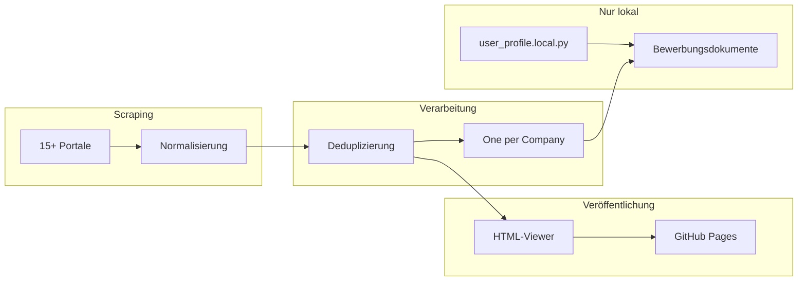

# AusbildungHunter Intelligence

[](https://www.python.org/downloads/)
[](#scraping-quellen)
[](#one-per-company)
[](LICENSE)
[](https://acimdamero.github.io/ausbildung-scraper/)

> **Tagline:** Multi-Portal FI-Ausbildungssuche, Deduplizierung und intelligente Bewerbungsgenerierung.

**AusbildungHunter Intelligence** (AHI) vereint drei Konzepte in einer Pipeline:

- **Ausbildung Intelligence** — Stellen aus 15+ Portalen sammeln, deduplizieren und durchsuchen
- **FI-Ausbildung Hunter** — Fokus auf *Fachinformatiker/in Anwendungsentwicklung* (und verwandte FI-Profile)
- **Bewerbung Engine** — Firmenrecherche + personalisierte Bewerbungsunterlagen (DE + ID), nur lokal

| Sprache | README |
|---------|--------|
| English | [README.md](README.md) |
| Bahasa Indonesia | [README.id.md](README.id.md) |

## Highlights

| Funktion | Beschreibung |
|----------|--------------|
| Multi-Portal-Scraping | Arbeitsagentur-API + 14 browserbasierte Portale |
| Intelligente Deduplizierung | Quellenübergreifend nach Referenznummer und Hash |
| Durchsuchbarer Viewer | Filter nach Stadt, Firma, Portal, Kategorie — reines HTML |
| One-per-Company | Beste Stelle pro Unternehmen für effiziente Bewerbungen |
| Bewerbung Intelligence | Firmenrecherche, Anschreiben, Motivationsschreiben, E-Mail-Entwürfe (DE + ID) |
| Datenschutz zuerst | Bewerberprofil und Briefe bleiben lokal — nie in Git |

## Technologie-Stack

[](https://www.python.org/downloads/)
[](https://playwright.dev/)
[](https://requests.readthedocs.io/)
[](.github/workflows/pages.yml)
[](https://acimdamero.github.io/ausbildung-scraper/)
[](config/categories.yaml)

| Kategorie | Technologien |
|-----------|--------------|
| **Sprachen** | Python 3.10+, HTML5, CSS3, Vanilla JavaScript |
| **Backend & Scraping** | `requests` (Arbeitsagentur REST-API + Firmenrecherche), Playwright/Chromium (14 dynamische Portale), `ThreadPoolExecutor` für parallele API-Abfragen |
| **Parsing & Konfiguration** | JSON / JSON-LD, Regex-HTML-Extraktion, `pyyaml` (`config/categories.yaml`, `fields_mapping.yaml`), `python-dotenv` |
| **Daten-Pipeline** | JSON- & CSV-I/O, quellenübergreifende Dedup (`src/storage/dedup.py`), One-per-Company-Export, Fortschritts-Tracking, optional `gspread` → Google Sheets |
| **Frontend** | Eigenständiger HTML-Viewer (`data/viewer/`), intelligente Suche mit Autovervollständigung, eingebettetes JSON (ohne Backend), Dark-Theme-CSS, `localStorage`-Status (Bewerbungs-UI) |
| **Bewerbung Intelligence** | `company_research.py`, `contact_extractor.py`, `doc_generator.py` (DE + ID), `user_profile.local.py`, mailto-Helfer — alles nur lokal |
| **DevOps & Tooling** | Git, Bash-Pipeline-Skripte (`run_background_pipeline.sh`), GitHub Actions → GitHub Pages, MIT-Lizenz |

```text
Python-Scraper ──► JSON/CSV ──► Dedup ──► HTML-Viewer ──► GitHub Pages
                                      └──► Bewerbungsdokumente (lokal)
```

## Live-Demo

**Stellenviewer (öffentlich):** https://acimdamero.github.io/ausbildung-scraper/

**Bewerbungs-UI-Demo (Beispieldaten):** `data/public/bewerbung-demo/index.html` nach dem Klonen öffnen

## Architektur



Details: [docs/ARCHITECTURE.md](docs/ARCHITECTURE.md)

## Repository-Struktur

```
ausbildung-scraper/
├── README.md, README.de.md, README.id.md
├── config/                 # Suchkategorien & Feld-Mapping
├── docs/                   # Architektur, Datenschutz, Portal-Guides
├── scripts/                # Scraper, Dedup, Viewer, Bewerbung
├── src/
│   ├── api_client/         # Arbeitsagentur REST
│   ├── scraper/            # Portal-Fetcher
│   ├── parser/             # Normalisierung
│   ├── storage/            # Export, Dedup, Fortschritt
│   └── bewerbung/          # Profil, Recherche, Dokumente
├── data/
│   ├── processed/          # Deduplizierte JSON/CSV
│   ├── viewer/             # Öffentlicher Viewer → GitHub Pages
│   └── public/             # Bewerbungs-Demo ohne PII
└── .github/workflows/      # Pages-Deploy
```

## Scraping-Quellen

| Portal | Skript | Status | Hinweise |
|--------|--------|--------|----------|
| Arbeitsagentur | `run_scraper.py` | ✅ Aktiv | Offizielle REST-API |
| ausbildung.de | `run_ausbildung_de.py` | ✅ Aktiv | Playwright, JSON-LD |
| Ausbildung.NRW | `run_ausbildung_nrw.py` | ✅ Aktiv | Regionalportal |
| meine-ausbildung.de | `run_meine_ausbildung_de.py` | ✅ Aktiv | Playwright |
| azubi.de | `run_azubi_de.py` | ✅ Aktiv | FI-Suche |
| azubiyo.de | `run_azubiyo_de.py` | ✅ Aktiv | Playwright |
| StepStone | `run_stepstone_de.py` | ✅ Aktiv | Anti-Bot-Handling |
| ausbildungsstellen.de | `run_ausbildungsstellen_de.py` | ✅ Aktiv | Mehrere FI-Kategorien |
| aubi-plus.de | `run_aubi_plus_de.py` | ✅ Aktiv | Playwright |
| wir-sind-bund.de | `run_wir_sind_bund_de.py` | ✅ Aktiv | Öffentlicher Dienst |
| karriere-suedwestfalen.de | `run_karriere_suedwestfalen_de.py` | ✅ Aktiv | Regional |
| ausbildungsmarkt.de | `run_ausbildungsmarkt_de.py` | ✅ Aktiv | Playwright |
| backinjob.de | `run_backinjob_de.py` | ✅ Aktiv | Playwright |
| Indeed DE | `run_indeed_de.py` | ⚠️ Teilweise | Shards, Anti-Bot-Limits |
| meinestadt.de | `run_meinestadt_de.py` | ⚠️ Geringe Ausbeute | Langsam |

Portal-Docs: `docs/*_SCRAPING.md`

## Schnellstart

### Voraussetzungen

- Python 3.10+
- Chromium für Playwright (`playwright install chromium`)

### Einrichtung

```bash
git clone https://github.com/Acimdamero/ausbildung-scraper.git
cd ausbildung-scraper
python3 -m venv .venv
source .venv/bin/activate
pip install -r requirements.txt
playwright install chromium
cp .env.example .env
```

### Arbeitsagentur-Scraper (API)

```bash
python scripts/run_scraper.py --max-pages 1    # Test
python scripts/run_scraper.py --max-pages 3 --workers 3   # Empfohlen
```

### Deduplizieren & ansehen

```bash
python scripts/dedup_data.py
python scripts/generate_viewer.py
open data/viewer/index.html
```

### One-per-Company

```bash
python scripts/export_one_per_company.py
```

## Bewerbung Intelligence (nur lokal)

```bash
cp src/bewerbung/user_profile.example.py src/bewerbung/user_profile.local.py
# user_profile.local.py bearbeiten — niemals committen

python scripts/generate_bewerbung_exports.py
python scripts/run_bewerbung_pilot.py --limit 10
python scripts/generate_bewerbung_ui.py
open data/bewerbung/index.html
```

Kein automatischer E-Mail-Versand. Siehe [docs/BEWERBUNG_SYSTEM.md](docs/BEWERBUNG_SYSTEM.md).

## Git-Workflow

```bash
git checkout -b feature/meine-aenderung
git add <dateien>   # nie user_profile.local.py oder data/bewerbung/
git commit -m "Beschreibung"
git push -u origin feature/meine-aenderung
```

## Datenschutz: öffentlich vs. privat

| Öffentlich (GitHub + Pages) | Privat (nur lokal) |
|-----------------------------|---------------------|
| Stellenviewer | `user_profile.local.py` |
| Bewerbungs-Demo | `data/bewerbung/index.html` |
| Scraper-Code & Docs | `bewerbung_enriched.json` |
| Dedup-Statistiken | Echte Anschreiben / E-Mails |
| | `.env`, Zugangsdaten |

Details: [docs/PRIVACY.md](docs/PRIVACY.md) · Zugang: [docs/ACCESS.md](docs/ACCESS.md)

## GitHub Pages

Automatisches Deploy aus `data/viewer/` bei Push auf `main`.

Anleitung: [docs/github-pages-setup.md](docs/github-pages-setup.md)

## Dokumentation

- [Architektur](docs/ARCHITECTURE.md)
- [Daten-Pipeline](docs/DATA_PIPELINE.md)
- [Bewerbungssystem](docs/BEWERBUNG_SYSTEM.md)
- [Datenschutz](docs/PRIVACY.md)
- [Zugang / Review](docs/ACCESS.md)
- [Mitwirken](CONTRIBUTING.md)

## Lizenz

MIT — verantwortungsvoll nutzen; Portal-Bedingungen und Rate Limits beachten.
