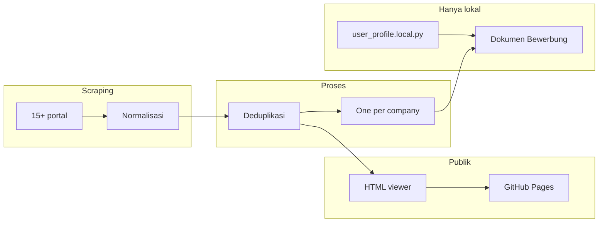

# AusbildungHunter Intelligence

[](https://www.python.org/downloads/)
[](#sumber-scraping)
[](#one-per-company)
[](LICENSE)
[](https://acimdamero.github.io/ausbildung-scraper/)

> **Tagline:** Pencarian Ausbildung FI multi-portal, deduplikasi, dan generasi Bewerbung cerdas.

**AusbildungHunter Intelligence** (AHI) menggabungkan tiga konsep dalam satu pipeline:

- **Ausbildung Intelligence** — agregasi, deduplikasi, dan pencarian lowongan dari 15+ portal Jerman
- **FI-Ausbildung Hunter** — fokus *Fachinformatiker/in Anwendungsentwicklung* (dan profil FI terkait)
- **Bewerbung Engine** — riset perusahaan + dokumen lamaran personal (DE + ID), hanya lokal

| Bahasa | README |
|--------|--------|
| English | [README.md](README.md) |
| Deutsch | [README.de.md](README.de.md) |

## Sorotan

| Fitur | Deskripsi |
|-------|-----------|
| Scraping multi-portal | API Arbeitsagentur + 14 portal berbasis browser |
| Deduplikasi cerdas | Dedup lintas sumber berdasarkan ID referensi dan hash |
| Viewer dapat dicari | Filter kota, perusahaan, portal, kategori — HTML tanpa backend |
| One-per-company | Lowongan terbaik per perusahaan untuk lamaran efisien |
| Bewerbung Intelligence | Riset perusahaan, Anschreiben, Motivationsschreiben, draft email (DE + ID) |
| Privasi dulu | Profil pelamar dan surat lamaran tetap lokal — tidak masuk git |

## Demo live

**Viewer lowongan (publik):** https://acimdamero.github.io/ausbildung-scraper/

**Demo UI Bewerbung (data contoh):** buka `data/public/bewerbung-demo/index.html` setelah clone

## Arsitektur



Detail lengkap: [docs/ARCHITECTURE.md](docs/ARCHITECTURE.md)

## Struktur repository

```
ausbildung-scraper/
├── README.md, README.de.md, README.id.md
├── config/                 # Kategori pencarian & mapping field
├── docs/                   # Arsitektur, privasi, panduan portal
├── scripts/                # Scraper, dedup, viewer, Bewerbung
├── src/
│   ├── api_client/         # REST Arbeitsagentur
│   ├── scraper/            # Fetcher portal
│   ├── parser/             # Normalisasi
│   ├── storage/            # Export, dedup, progress
│   └── bewerbung/          # Profil, riset, generator dokumen
├── data/
│   ├── processed/          # JSON/CSV deduplikasi
│   ├── viewer/             # Viewer publik → GitHub Pages
│   └── public/             # Demo Bewerbung tanpa PII
└── .github/workflows/      # Deploy Pages
```

## Sumber scraping

| Portal | Skrip | Status | Catatan |
|--------|-------|--------|---------|
| Arbeitsagentur | `run_scraper.py` | ✅ Aktif | API REST resmi |
| ausbildung.de | `run_ausbildung_de.py` | ✅ Aktif | Playwright, JSON-LD |
| Ausbildung.NRW | `run_ausbildung_nrw.py` | ✅ Aktif | Portal regional |
| meine-ausbildung.de | `run_meine_ausbildung_de.py` | ✅ Aktif | Playwright |
| azubi.de | `run_azubi_de.py` | ✅ Aktif | Pencarian FI |
| azubiyo.de | `run_azubiyo_de.py` | ✅ Aktif | Playwright |
| StepStone | `run_stepstone_de.py` | ✅ Aktif | Anti-bot |
| ausbildungsstellen.de | `run_ausbildungsstellen_de.py` | ✅ Aktif | Beberapa kategori FI |
| aubi-plus.de | `run_aubi_plus_de.py` | ✅ Aktif | Playwright |
| wir-sind-bund.de | `run_wir_sind_bund_de.py` | ✅ Aktif | Sektor publik |
| karriere-suedwestfalen.de | `run_karriere_suedwestfalen_de.py` | ✅ Aktif | Regional |
| ausbildungsmarkt.de | `run_ausbildungsmarkt_de.py` | ✅ Aktif | Playwright |
| backinjob.de | `run_backinjob_de.py` | ✅ Aktif | Playwright |
| Indeed DE | `run_indeed_de.py` | ⚠️ Sebagian | Shard batch, limit anti-bot |
| meinestadt.de | `run_meinestadt_de.py` | ⚠️ Yield rendah | Lambat |

Dok per portal: `docs/*_SCRAPING.md`

## Mulai cepat

### Prasyarat

- Python 3.10+
- Chromium untuk Playwright (`playwright install chromium`)

### Setup

```bash
git clone https://github.com/Acimdamero/ausbildung-scraper.git
cd ausbildung-scraper
python3 -m venv .venv
source .venv/bin/activate
pip install -r requirements.txt
playwright install chromium
cp .env.example .env
```

### Scraper Arbeitsagentur (API)

```bash
python scripts/run_scraper.py --max-pages 1    # tes
python scripts/run_scraper.py --max-pages 3 --workers 3   # disarankan
```

### Dedup & lihat data

```bash
python scripts/dedup_data.py
python scripts/generate_viewer.py
open data/viewer/index.html
```

### One-per-company

```bash
python scripts/export_one_per_company.py
```

## Bewerbung Intelligence (hanya lokal)

```bash
cp src/bewerbung/user_profile.example.py src/bewerbung/user_profile.local.py
# Edit user_profile.local.py dengan data ANDA — jangan commit

python scripts/generate_bewerbung_exports.py
python scripts/run_bewerbung_pilot.py --limit 10
python scripts/generate_bewerbung_ui.py
open data/bewerbung/index.html
```

Tidak ada pengiriman email otomatis. Lihat [docs/BEWERBUNG_SYSTEM.md](docs/BEWERBUNG_SYSTEM.md).

## Alur git

```bash
git checkout -b feature/perubahan-saya
git add <file>   # jangan user_profile.local.py atau data/bewerbung/
git commit -m "Deskripsi perubahan"
git push -u origin feature/perubahan-saya
```

## Privasi: publik vs privat

| Publik (GitHub + Pages) | Privat (lokal saja) |
|-------------------------|---------------------|
| Viewer lowongan | `user_profile.local.py` |
| Demo Bewerbung | `data/bewerbung/index.html` |
| Kode scraper & docs | `bewerbung_enriched.json` |
| Statistik dedup | Anschreiben / email asli |
| | `.env`, kredensial |

Detail: [docs/PRIVACY.md](docs/PRIVACY.md) · Panduan akses: [docs/ACCESS.md](docs/ACCESS.md)

## GitHub Pages

Deploy otomatis dari `data/viewer/` saat push ke `main`.

Setup: [docs/github-pages-setup.md](docs/github-pages-setup.md)

## Dokumentasi

- [Arsitektur](docs/ARCHITECTURE.md)
- [Pipeline data](docs/DATA_PIPELINE.md)
- [Sistem Bewerbung](docs/BEWERBUNG_SYSTEM.md)
- [Privasi](docs/PRIVACY.md)
- [Akses / review](docs/ACCESS.md)
- [Berkontribusi](CONTRIBUTING.md)

## Lisensi

MIT — gunakan dengan bijak; hormati ketentuan portal dan rate limit API.
