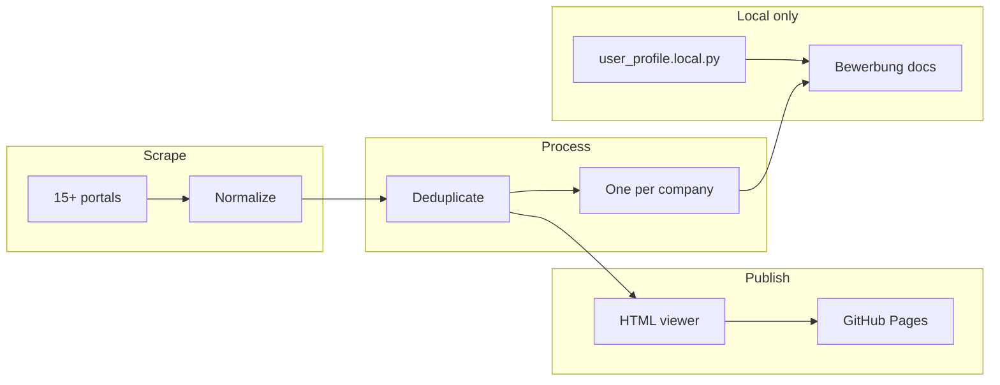

# AusbildungHunter Intelligence

[](https://www.python.org/downloads/)
[](#scraping-sources)
[](#one-per-company)
[](LICENSE)
[](https://acimdamero.github.io/ausbildung-scraper/)

> **Tagline:** Multi-portal FI apprenticeship discovery, deduplication, and intelligent Bewerbung generation.

**AusbildungHunter Intelligence** (AHI) combines three ideas into one pipeline:

- **Ausbildung Intelligence** — aggregate, dedupe, and search listings across 15+ German job portals
- **FI-Ausbildung Hunter** — focused on *Fachinformatiker/in Anwendungsentwicklung* (and related FI profiles)
- **Bewerbung Engine** — company research + personalized application documents (DE + ID), local-only

| Language | README |
|----------|--------|
| Deutsch | [README.de.md](README.de.md) |
| Bahasa Indonesia | [README.id.md](README.id.md) |

## Highlights

| Feature | Description |
|---------|-------------|
| Multi-portal scraping | Arbeitsagentur API + 14 browser-based portals |
| Smart deduplication | Cross-source dedup by reference ID and content hash |
| Searchable viewer | Filter by city, company, portal, category — embedded HTML, no backend |
| One-per-company | Best listing per company for efficient Bewerbung outreach |
| Bewerbung Intelligence | Company research, Anschreiben, Motivationsschreiben, email drafts (DE + ID) |
| Privacy-first | Applicant profile and generated letters stay local — never in git |

## Tech Stack

[](https://www.python.org/downloads/)
[](https://playwright.dev/)
[](https://requests.readthedocs.io/)
[](.github/workflows/pages.yml)
[](https://acimdamero.github.io/ausbildung-scraper/)
[](config/categories.yaml)

| Category | Technologies |
|----------|--------------|
| **Languages** | Python 3.10+, HTML5, CSS3, Vanilla JavaScript |
| **Backend & Scraping** | `requests` (Arbeitsagentur REST API + company research), Playwright/Chromium (14 dynamic portals), `ThreadPoolExecutor` for parallel API fetches |
| **Parsing & Config** | JSON / JSON-LD, regex HTML extraction, `pyyaml` (`config/categories.yaml`, `fields_mapping.yaml`), `python-dotenv` |
| **Data Pipeline** | JSON & CSV I/O, cross-source dedup (`src/storage/dedup.py`), one-per-company export, progress tracking, optional `gspread` → Google Sheets |
| **Frontend** | Self-contained HTML viewer (`data/viewer/`), smart search with autocomplete, embedded JSON (zero backend), dark-theme CSS, `localStorage` status (Bewerbung UI) |
| **Bewerbung Intelligence** | `company_research.py`, `contact_extractor.py`, `doc_generator.py` (DE + ID), `user_profile.local.py`, mailto helpers — all local-only |
| **DevOps & Tooling** | Git, Bash pipeline scripts (`run_background_pipeline.sh`), GitHub Actions → GitHub Pages, MIT license |

```text
Python scrapers ──► JSON/CSV ──► dedup ──► HTML viewer ──► GitHub Pages
                                      └──► Bewerbung docs (local)
```

## Live demo

**Job listing viewer (public):** https://acimdamero.github.io/ausbildung-scraper/

**Bewerbung UI demo (sample data):** open `data/public/bewerbung-demo/index.html` after clone

## Architecture



Full details: [docs/ARCHITECTURE.md](docs/ARCHITECTURE.md)

## Repository structure

```
ausbildung-scraper/
├── README.md, README.de.md, README.id.md
├── config/                 # Search categories & field mapping
├── docs/                   # Architecture, privacy, portal guides
├── scripts/                # Scrapers, dedup, viewer, Bewerbung
├── src/
│   ├── api_client/         # Arbeitsagentur REST
│   ├── scraper/            # Portal fetchers
│   ├── parser/             # Normalization
│   ├── storage/            # Export, dedup, progress
│   └── bewerbung/          # Profile, research, doc generation
├── data/
│   ├── processed/          # Deduped JSON/CSV
│   ├── viewer/             # Public job viewer → GitHub Pages
│   └── public/             # Sample Bewerbung demo (no PII)
└── .github/workflows/      # Pages deploy
```

## Scraping sources

| Portal | Script | Status | Notes |
|--------|--------|--------|-------|
| Arbeitsagentur | `run_scraper.py` | ✅ Active | Official REST API, no browser |
| ausbildung.de | `run_ausbildung_de.py` | ✅ Active | Playwright, JSON-LD |
| Ausbildung.NRW | `run_ausbildung_nrw.py` | ✅ Active | Regional portal |
| meine-ausbildung.de | `run_meine_ausbildung_de.py` | ✅ Active | Playwright |
| azubi.de | `run_azubi_de.py` | ✅ Active | FI-focused search |
| azubiyo.de | `run_azubiyo_de.py` | ✅ Active | Playwright |
| StepStone | `run_stepstone_de.py` | ✅ Active | Anti-bot handling |
| ausbildungsstellen.de | `run_ausbildungsstellen_de.py` | ✅ Active | Multiple FI categories |
| aubi-plus.de | `run_aubi_plus_de.py` | ✅ Active | Playwright |
| wir-sind-bund.de | `run_wir_sind_bund_de.py` | ✅ Active | Public sector |
| karriere-suedwestfalen.de | `run_karriere_suedwestfalen_de.py` | ✅ Active | Regional |
| ausbildungsmarkt.de | `run_ausbildungsmarkt_de.py` | ✅ Active | Playwright |
| backinjob.de | `run_backinjob_de.py` | ✅ Active | Playwright |
| Indeed DE | `run_indeed_de.py` | ⚠️ Partial | Shard batches, anti-bot limits |
| meinestadt.de | `run_meinestadt_de.py` | ⚠️ Low yield | Dedicated AE URLs, slow |

Per-portal docs: `docs/*_SCRAPING.md`

## Quick start

### Prerequisites

- Python 3.10+
- Chromium for Playwright (`playwright install chromium`)

### Setup

```bash
git clone https://github.com/Acimdamero/ausbildung-scraper.git
cd ausbildung-scraper
python3 -m venv .venv
source .venv/bin/activate
pip install -r requirements.txt
playwright install chromium
cp .env.example .env
```

### Run Arbeitsagentur scraper (API)

```bash
# Quick test — 1 page per category
python scripts/run_scraper.py --max-pages 1

# Recommended — 3 pages per category
python scripts/run_scraper.py --max-pages 3 --workers 3
```

### Deduplicate & view

```bash
python scripts/dedup_data.py
python scripts/generate_viewer.py
open data/viewer/index.html
```

### One-per-company export

```bash
python scripts/export_one_per_company.py
# → data/processed/one_per_company.json
```

## Bewerbung Intelligence (local only)

```bash
cp src/bewerbung/user_profile.example.py src/bewerbung/user_profile.local.py
# Edit user_profile.local.py with YOUR data — never commit

python scripts/generate_bewerbung_exports.py
python scripts/run_bewerbung_pilot.py --limit 10
python scripts/generate_bewerbung_ui.py
open data/bewerbung/index.html
```

No automatic email sending — preview and mailto helpers only. See [docs/BEWERBUNG_SYSTEM.md](docs/BEWERBUNG_SYSTEM.md).

## Git workflow

```bash
git checkout -b feature/my-change
# ... make changes ...
git add <files>   # never add user_profile.local.py or data/bewerbung/
git commit -m "Describe your change"
git push -u origin feature/my-change
```

## Privacy: public vs private

| Public (GitHub + Pages) | Private (local only) |
|-------------------------|----------------------|
| Job listings viewer | `user_profile.local.py` |
| Sample Bewerbung demo | `data/bewerbung/index.html` |
| Scraper code & docs | `bewerbung_enriched.json` |
| Deduped listing stats | Real Anschreiben / emails |
| | `.env`, credentials |

Details: [docs/PRIVACY.md](docs/PRIVACY.md) · Access guide: [docs/ACCESS.md](docs/ACCESS.md)

## GitHub Pages

Deploys automatically from `data/viewer/` on push to `main`.

Setup: [docs/github-pages-setup.md](docs/github-pages-setup.md)

## Documentation

- [Architecture](docs/ARCHITECTURE.md)
- [Data pipeline](docs/DATA_PIPELINE.md)
- [Bewerbung system](docs/BEWERBUNG_SYSTEM.md)
- [Privacy](docs/PRIVACY.md)
- [Access / review guide](docs/ACCESS.md)
- [Contributing](CONTRIBUTING.md)

## License

MIT — use responsibly; respect portal terms and API rate limits.
