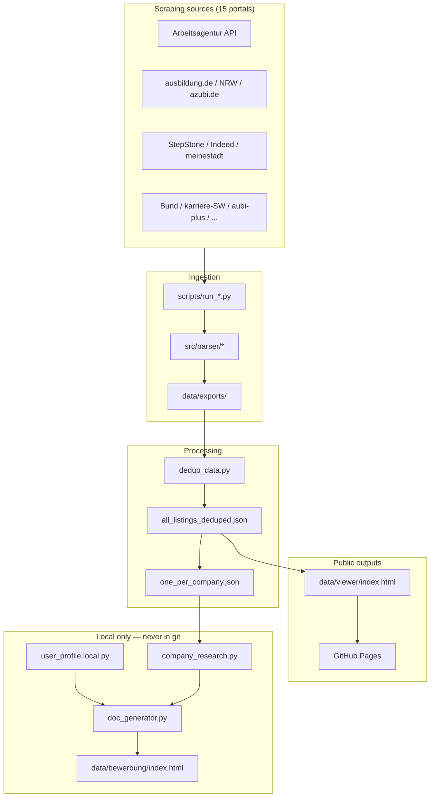
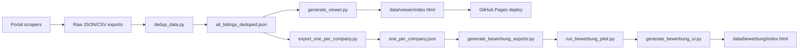

# AusbildungHunter Intelligence

[](https://www.python.org/downloads/)
[](#current-stats)
[](#current-stats)
[](LICENSE)
[](https://acimdamero.github.io/ausbildung-scraper/)

> **Tagline:** Multi-portal FI apprenticeship discovery, deduplication, and intelligent Bewerbung generation.

| Language | README |
|----------|--------|
| Deutsch | [README.de.md](README.de.md) |
| Bahasa Indonesia | [README.id.md](README.id.md) |

---

## What this project does

**Problem:** German apprenticeship listings for *Fachinformatiker/in Anwendungsentwicklung* (FI-AE) are scattered across 15+ job portals. Manual search is slow, duplicates are everywhere, and preparing personalized Bewerbungen for hundreds of companies is overwhelming.

**Solution:** **AusbildungHunter Intelligence** (AHI) is an end-to-end pipeline that:

1. **Scrapes** 15 German portals (REST API + Playwright)
2. **Normalizes** listings into one data model (`AusbildungListing`)
3. **Deduplicates** cross-source duplicates (~6,850 unique listings)
4. **Publishes** a searchable HTML viewer on GitHub Pages
5. **Generates** personalized Bewerbung documents locally (DE + ID) — never uploaded

Three modules, one codebase:

| Module | Purpose |
|--------|---------|
| **Ausbildung Intelligence** | Aggregate, dedupe, and search listings across all portals |
| **FI-Ausbildung Hunter** | Focus on *Fachinformatiker/in Anwendungsentwicklung* and related FI profiles |
| **Bewerbung Engine** | Company research + Anschreiben, Motivationsschreiben, email drafts (local-only) |

---

## Current stats

| Metric | Value | Source file |
|--------|-------|-------------|
| Deduped listings | **6,850** | `data/processed/all_listings_deduped.json` |
| Unique companies | **3,895** | `data/processed/one_per_company.json` |
| Active portals | **15** | See [scraping sources](#scraping-sources) |
| FI categories | AE, AE 2026, DPA | `config/categories.yaml` |

Top sources by deduped count: ausbildungsstellen.de (2,647), Arbeitsagentur (1,107), meine-ausbildung (745), azubi.de (645), StepStone (576).

---

## Highlights

| Feature | Description |
|---------|-------------|
| Multi-portal scraping | Arbeitsagentur REST API + 14 browser-based portals |
| Smart deduplication | Cross-source dedup by reference ID and content hash |
| Searchable viewer | Filter by city, company, portal, category — embedded HTML, no backend |
| One-per-company | Best listing per company for efficient Bewerbung outreach |
| Bewerbung Intelligence | Company research, Anschreiben, Motivationsschreiben, email drafts (DE + ID) |
| Privacy-first | Applicant profile and generated letters stay local — never in git |

---

## Tech stack

[](https://www.python.org/downloads/)
[](https://playwright.dev/)
[](https://requests.readthedocs.io/)
[](.github/workflows/pages.yml)
[](https://acimdamero.github.io/ausbildung-scraper/)
[](config/categories.yaml)

| Category | Technologies |
|----------|--------------|
| **Languages** | Python 3.10+, HTML5, CSS3, Vanilla JavaScript |
| **Backend & Scraping** | `requests` (Arbeitsagentur REST API + company research), Playwright/Chromium (14 dynamic portals), `ThreadPoolExecutor` for parallel API fetches |
| **Parsing & Config** | JSON / JSON-LD, regex HTML extraction, `pyyaml` (`config/categories.yaml`, `fields_mapping.yaml`), `python-dotenv` |
| **Data Pipeline** | JSON & CSV I/O, cross-source dedup (`src/storage/dedup.py`), one-per-company export, progress tracking, optional `gspread` → Google Sheets |
| **Frontend** | Self-contained HTML viewer (`data/viewer/`), smart search with autocomplete, embedded JSON (zero backend), dark-theme CSS, `localStorage` status (Bewerbung UI) |
| **Bewerbung Intelligence** | `company_research.py`, `contact_extractor.py`, `doc_generator.py` (DE + ID), `user_profile.local.py`, mailto helpers — all local-only |
| **DevOps & Tooling** | Git, Bash pipeline scripts (`run_background_pipeline.sh`), GitHub Actions → GitHub Pages, MIT license |

---

## Live demo

| Resource | URL / path |
|----------|------------|
| **Job listing viewer** (public) | https://acimdamero.github.io/ausbildung-scraper/ |
| **Bewerbung UI demo** (sample data, no PII) | `data/public/bewerbung-demo/index.html` |

> **Note:** If the GitHub Pages URL returns 404, enable Pages in **Settings → Pages → Build and deployment → GitHub Actions**. See [docs/github-pages-setup.md](docs/github-pages-setup.md).

---

## Architecture



Full details: [docs/ARCHITECTURE.md](docs/ARCHITECTURE.md) · [Deutsch](docs/ARCHITECTURE.de.md)

---

## Data pipeline flow



| Step | Command | Output |
|------|---------|--------|
| 1. Scrape | `python scripts/run_scraper.py --max-pages 3` | `data/exports/*.json` |
| 2. Dedup | `python scripts/dedup_data.py` | `data/processed/all_listings_deduped.json` |
| 3. Viewer | `python scripts/generate_viewer.py` | `data/viewer/index.html` |
| 4. One-per-company | `python scripts/export_one_per_company.py` | `data/processed/one_per_company.json` |
| 5. Bewerbung (local) | `python scripts/run_bewerbung_pilot.py --limit 10` | `data/bewerbung/index.html` |

See [docs/DATA_PIPELINE.md](docs/DATA_PIPELINE.md) for field mapping and quality checks.

---

## Repository structure

```
ausbildung-scraper/
├── README.md, README.de.md, README.id.md
├── LICENSE, CONTRIBUTING.md
├── config/                 # Search categories & field mapping
│   ├── categories.yaml
│   └── fields_mapping.yaml
├── docs/                   # Architecture, privacy, portal guides
├── scripts/                # Scrapers, dedup, viewer, Bewerbung
│   ├── run_scraper.py      # Arbeitsagentur API
│   ├── run_*.py            # 14 portal scrapers
│   ├── dedup_data.py
│   ├── generate_viewer.py
│   └── run_bewerbung_pilot.py
├── src/
│   ├── api_client/         # Arbeitsagentur REST
│   ├── scraper/            # Portal fetchers
│   ├── parser/             # Normalization → AusbildungListing
│   ├── storage/            # Export, dedup, progress
│   └── bewerbung/          # Profile, research, doc generation
├── data/
│   ├── processed/          # Deduped JSON/CSV (public)
│   ├── viewer/             # Public job viewer → GitHub Pages
│   └── public/             # Sample Bewerbung demo (no PII)
└── .github/workflows/      # Pages deploy
```

---

## Scraping sources

All **15 portals** integrated into the pipeline:

| # | Portal | Script | Status | Technology |
|---|--------|--------|--------|------------|
| 1 | Arbeitsagentur | `run_scraper.py` | ✅ Active | Official REST API, no browser |
| 2 | ausbildung.de | `run_ausbildung_de.py` | ✅ Active | Playwright, JSON-LD |
| 3 | Ausbildung.NRW | `run_ausbildung_nrw.py` | ✅ Active | Regional portal |
| 4 | meine-ausbildung.de | `run_meine_ausbildung_de.py` | ✅ Active | Playwright |
| 5 | azubi.de | `run_azubi_de.py` | ✅ Active | FI-focused search |
| 6 | azubiyo.de | `run_azubiyo_de.py` | ✅ Active | Playwright |
| 7 | StepStone | `run_stepstone_de.py` | ✅ Active | Anti-bot handling |
| 8 | ausbildungsstellen.de | `run_ausbildungsstellen_de.py` | ✅ Active | Multiple FI categories |
| 9 | aubi-plus.de | `run_aubi_plus_de.py` | ✅ Active | Playwright |
| 10 | wir-sind-bund.de | `run_wir_sind_bund_de.py` | ✅ Active | Public sector |
| 11 | karriere-suedwestfalen.de | `run_karriere_suedwestfalen_de.py` | ✅ Active | Regional |
| 12 | ausbildungsmarkt.de | `run_ausbildungsmarkt_de.py` | ✅ Active | Playwright |
| 13 | backinjob.de | `run_backinjob_de.py` | ✅ Active | Playwright |
| 14 | Indeed DE | `run_indeed_de.py` | ⚠️ Partial | Shard batches, anti-bot limits |
| 15 | meinestadt.de | `run_meinestadt_de.py` | ⚠️ Low yield | Dedicated AE URLs, slow |

Per-portal docs: `docs/*_SCRAPING.md`

---

## Quick start

### Prerequisites

- Python 3.10+
- Chromium for Playwright: `playwright install chromium`

### Setup

```bash
git clone https://github.com/Acimdamero/ausbildung-scraper.git
cd ausbildung-scraper
python3 -m venv .venv
source .venv/bin/activate          # Windows: .venv\Scripts\activate
pip install -r requirements.txt
playwright install chromium
cp .env.example .env
```

### Run Arbeitsagentur scraper (API)

```bash
# Quick test — 1 page per category
python scripts/run_scraper.py --max-pages 1

# Recommended — 3 pages per category
python scripts/run_scraper.py --max-pages 3 --workers 3
```

### Deduplicate & open viewer

```bash
python scripts/dedup_data.py
python scripts/generate_viewer.py
open data/viewer/index.html        # macOS; or open in any browser
```

### One-per-company export

```bash
python scripts/export_one_per_company.py
# → data/processed/one_per_company.json (3,895 companies)
```

---

## Bewerbung Intelligence (local only)

The Bewerbung pipeline generates personalized application documents. **All output stays on your machine.**

```bash
cp src/bewerbung/user_profile.example.py src/bewerbung/user_profile.local.py
# Edit user_profile.local.py with YOUR data — never commit this file

python scripts/generate_bewerbung_exports.py
python scripts/run_bewerbung_pilot.py --limit 10
python scripts/generate_bewerbung_ui.py
open data/bewerbung/index.html
```

- No automatic email sending — preview and mailto helpers only
- Documents generated in **German** and **Indonesian**
- See [docs/BEWERBUNG_SYSTEM.md](docs/BEWERBUNG_SYSTEM.md)

---

## How others can review or help with Bewerbung

| Goal | What to share | Safe? |
|------|---------------|-------|
| Browse job database | [GitHub Pages viewer](https://acimdamero.github.io/ausbildung-scraper/) | ✅ Public |
| See Bewerbung UI layout | `data/public/bewerbung-demo/index.html` (sample data) | ✅ Public |
| Review real Anschreiben | Send redacted PDFs or screen recording directly | ✅ Private channel |
| Review real letters via git | **Never** — not in the repo | ❌ |

**Suggested review checklist for helpers:**

- [ ] German grammar and tone (Sie-form, formal structure)
- [ ] Company-specific paragraphs (not generic copy-paste)
- [ ] Motivation for FI-AE career switch is clear
- [ ] Contact block is correct (review locally only)
- [ ] Email subject includes Ausbildung title and reference number

Full access guide: [docs/ACCESS.md](docs/ACCESS.md) · [Deutsch](docs/ACCESS.de.md)

---

## Privacy: public vs private

| Public (GitHub + Pages) | Private (local only) |
|-------------------------|----------------------|
| Job listings viewer | `user_profile.local.py` |
| Sample Bewerbung demo | `data/bewerbung/index.html` |
| Scraper code & docs | `bewerbung_enriched.json` |
| Deduped listing stats | Real Anschreiben / emails |
| | `.env`, credentials |

Before pushing, verify no PII is staged:

```bash
git status
rg -i "gmail|@.*\.de" --glob '!*.local.py' --glob '!.git'
```

Details: [docs/PRIVACY.md](docs/PRIVACY.md)

---

## Git workflow for contributors

```bash
git checkout -b feature/my-change
# ... make changes ...
git add <files>   # never add user_profile.local.py or data/bewerbung/
git commit -m "Describe your change"
git push -u origin feature/my-change
# Open a pull request on GitHub
```

See [CONTRIBUTING.md](CONTRIBUTING.md) for the full checklist.

---

## GitHub Pages

The viewer deploys automatically from `data/viewer/` on push to `main` or `cursor/arbeitsagentur-ausbildung-scraper` via [`.github/workflows/pages.yml`](.github/workflows/pages.yml).

**First-time setup:** Repository **Settings → Pages → Source: GitHub Actions**. See [docs/github-pages-setup.md](docs/github-pages-setup.md).

---

## Documentation

| Topic | English | Deutsch |
|-------|---------|---------|
| Architecture | [ARCHITECTURE.md](docs/ARCHITECTURE.md) | [ARCHITECTURE.de.md](docs/ARCHITECTURE.de.md) |
| Access / review | [ACCESS.md](docs/ACCESS.md) | [ACCESS.de.md](docs/ACCESS.de.md) |
| Data pipeline | [DATA_PIPELINE.md](docs/DATA_PIPELINE.md) | — |
| Bewerbung system | [BEWERBUNG_SYSTEM.md](docs/BEWERBUNG_SYSTEM.md) | — |
| Privacy | [PRIVACY.md](docs/PRIVACY.md) | — |
| GitHub Pages setup | [github-pages-setup.md](docs/github-pages-setup.md) | — |
| Contributing | [CONTRIBUTING.md](CONTRIBUTING.md) | — |

---

## License

MIT License — Copyright (c) 2026 Acim Damero.

Use responsibly; respect portal terms of service and API rate limits.
