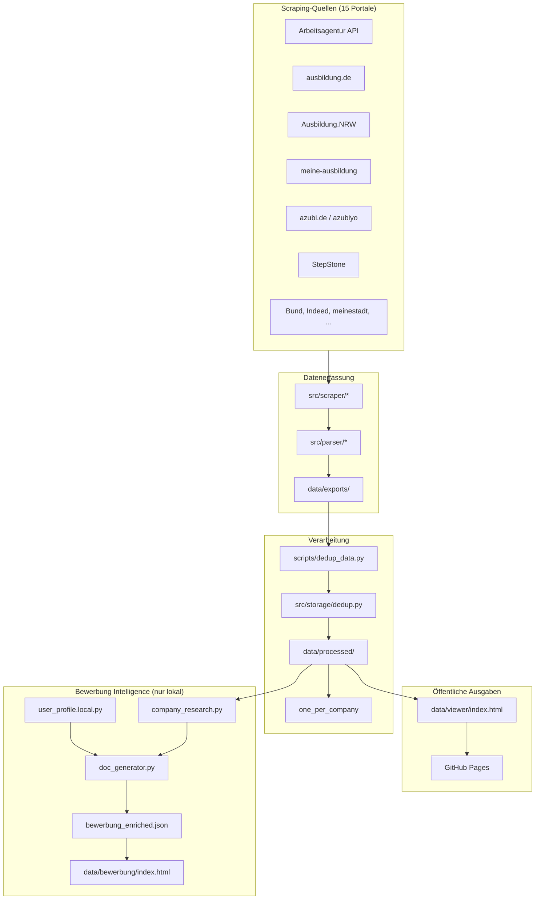
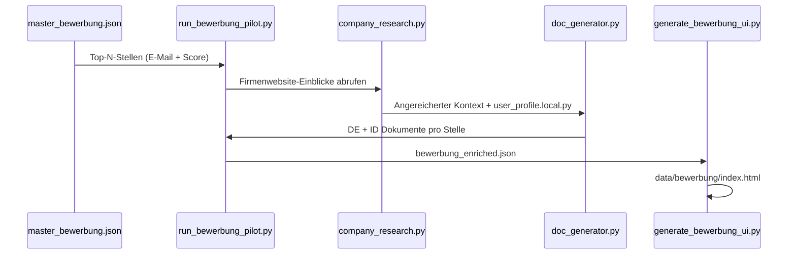

# Architektur — AusbildungHunter Intelligence

> **Tagline:** Multi-Portal FI-Ausbildungssuche, Deduplizierung und intelligente Bewerbungsgenerierung.

| Sprache | Dokument |
|---------|----------|
| English | [ARCHITECTURE.md](ARCHITECTURE.md) |

---

## Systemübersicht



---

## Technologie-Stack

[](https://www.python.org/downloads/)
[](https://playwright.dev/)
[](../.github/workflows/pages.yml)
[](https://acimdamero.github.io/ausbildung-scraper/)

| Schicht | Komponenten |
|---------|-------------|
| **Runtime** | Python 3.10+, stdlib (`json`, `csv`, `re`, `dataclasses`, `argparse`, `logging`, `pathlib`, `threading`) |
| **Datenerfassung** | `requests` + Arbeitsagentur Jobsuche-API; Playwright/Chromium für JS-gerenderte Portale; Portal-Runner in `scripts/run_*.py` |
| **Parsing** | Portal-spezifische Parser in `src/parser/`; JSON-LD-Extraktion; Regex-HTML-Bereinigung; `AusbildungListing`-Dataclass |
| **Speicherung** | Lokales JSON/CSV (`src/storage/local.py`), Dedup-Engine (`src/storage/dedup.py`), Fortschritts-JSON, optional Google Sheets (`gspread`) |
| **Verarbeitung** | `dedup_data.py`, `export_one_per_company.py`, `generate_bewerbung_exports.py`; YAML-Konfiguration via `pyyaml` |
| **Präsentation** | `generate_viewer.py` → eingebettetes JSON in statischem HTML; Vanilla-JS-Filter + intelligente Suche; Bewerbungs-UI via `generate_bewerbung_ui.py` |
| **Bewerbung (lokal)** | `company_research.py`, `doc_generator.py`, `contact_extractor.py`, `user_profile.local.py` |
| **Deploy** | GitHub Actions `pages.yml` veröffentlicht `data/viewer/`; Bash-Orchestrierung (`run_background_pipeline.sh`, `watch_progress.sh`) |

**Abhängigkeiten** (`requirements.txt`): `requests`, `playwright`, `pyyaml`, `python-dotenv`, `gspread`, `google-auth`.

**Bewusst nicht verwendet:** Selenium, BeautifulSoup — API-first wo möglich; Playwright nur wenn ein echter Browser nötig ist.

---

## Repository-Layout

```
ausbildung-scraper/
├── README.md, README.de.md, README.id.md
├── LICENSE, CONTRIBUTING.md, .gitignore
├── config/
│   ├── categories.yaml          # FI-Suchprofile (AE, AE 2026, DPA)
│   └── fields_mapping.yaml      # Normalisierte Felddefinitionen
├── docs/
│   ├── ARCHITECTURE.md / ARCHITECTURE.de.md
│   ├── PRIVACY.md, ACCESS.md / ACCESS.de.md
│   ├── github-pages-setup.md
│   └── *_SCRAPING.md            # Portal-spezifische Notizen
├── scripts/
│   ├── run_scraper.py           # Arbeitsagentur-API-Einstieg
│   ├── run_*.py                 # Portal-spezifische Scraper
│   ├── dedup_data.py            # Quellenübergreifende Deduplizierung
│   ├── generate_viewer.py       # HTML-Stellenviewer
│   ├── generate_bewerbung_exports.py
│   ├── run_bewerbung_pilot.py
│   └── generate_bewerbung_ui.py
├── src/
│   ├── api_client/              # Jobsuche REST-Client
│   ├── scraper/                 # Portal-Fetcher (API + Playwright)
│   ├── parser/                  # Rohes HTML/JSON → AusbildungListing
│   ├── models/                  # listing.py Dataclass
│   ├── storage/                 # local, sheets, dedup, progress
│   └── bewerbung/               # Profil, Recherche, Dokumentgenerierung
├── data/
│   ├── exports/                 # Rohe Scrape-Ausgabe (gitignored)
│   ├── processed/               # Deduplizierte JSON/CSV
│   ├── viewer/                  # Öffentlicher HTML-Viewer
│   ├── public/bewerbung-demo/   # Bewerbungs-UI-Demo (keine PII)
│   └── samples/                 # Kleine Testausgaben
└── .github/workflows/pages.yml  # GitHub-Pages-Deploy
```

---

## Datenmodell

Zentraler Typ: `AusbildungListing` (`src/models/listing.py`)

| Feldgruppe | Beispiele |
|------------|-----------|
| Identität | `referenznummer`, `sumber_data` |
| Unternehmen | `firma`, `ort`, `strasse`, `plz` |
| Stelle | `titel`, `beschreibung`, `ausbildungsart` |
| Kontakt | `email_bewerbung`, `link_bewerbung`, `website` |
| Meta | `kategorie`, `scraped_at`, Vollständigkeits-Flags |

---

## Deduplizierungsstrategie

1. **Primärschlüssel:** `referenznummer` wenn vorhanden (Arbeitsagentur)
2. **Sekundär-Hash:** Unternehmen + Titel + Stadt + Startdatum
3. **Kategorie-Priorität:** `ae_2026` > `dpa` > `ae`
4. **One-per-Company:** `scripts/export_one_per_company.py` → beste Stelle pro `firma`

Ausgabe: `all_listings_deduped.json` (~6.850 Stellen) und `one_per_company.json` (~3.895 Unternehmen).

---

## Scraper-Typen

| Typ | Portale | Technologie |
|-----|---------|-------------|
| REST-API | Arbeitsagentur | `requests`, öffentlicher API-Key |
| JSON-LD / DOM | ausbildung.de, azubiyo | Playwright Chromium |
| HTML-Paginierung | StepStone, Indeed, meinestadt | Playwright + Anti-Bot-Verzögerungen |
| Portal-spezifisch | NRW, Bund, karriere-suedwestfalen | Eigene Parser in `src/parser/` |

Gemeinsame Runner-Utilities: `scripts/portal_scrape_common.py`

---

## Bewerbung-Intelligence-Pipeline



**Datenschutz-Grenze:** Alles nach `user_profile.local.py` ist nur lokal und gitignored.

---

## Konfiguration

| Datei | Zweck |
|-------|-------|
| `.env` | API-Verzögerungen, Worker, optionale Google Sheets |
| `config/categories.yaml` | Suchanfragen für FI-Profile |
| `user_profile.local.py` | Private Bewerberdaten |

---

## Designentscheidungen

| Entscheidung | Begründung |
|--------------|------------|
| API-first für Arbeitsagentur | Stabil, schnell, kein Browser |
| Playwright für dynamische Seiten | Erforderlich für JS-gerenderte Stellen |
| Eingebettetes JSON im HTML-Viewer | Kein Backend; funktioniert auf GitHub Pages |
| Nur lokale Bewerbungsausgabe | DSGVO / Schutz personenbezogener Daten |
| Monorepo Scraper + Bewerbung | Ein deduplizierter Datensatz speist beide Flows |

---

## Erweiterungspunkte

- Neues Portal: `src/scraper/new_portal.py` + `src/parser/new_portal_parser.py` + `scripts/run_new_portal.py`
- NLP-E-Mail-Extraktion aus Beschreibungen (Roadmap)
- Gmail-API-Versand-Tracking (Roadmap — heute nur manueller Versand)

---

## Verwandte Dokumentation

- [DATA_PIPELINE.md](DATA_PIPELINE.md) — Scrape → Export-Flow
- [BEWERBUNG_SYSTEM.md](BEWERBUNG_SYSTEM.md) — Dokumentgenerierung
- [PRIVACY.md](PRIVACY.md) — Öffentliche vs. private Daten
- [ACCESS.de.md](ACCESS.de.md) — Zugangsleitfaden
