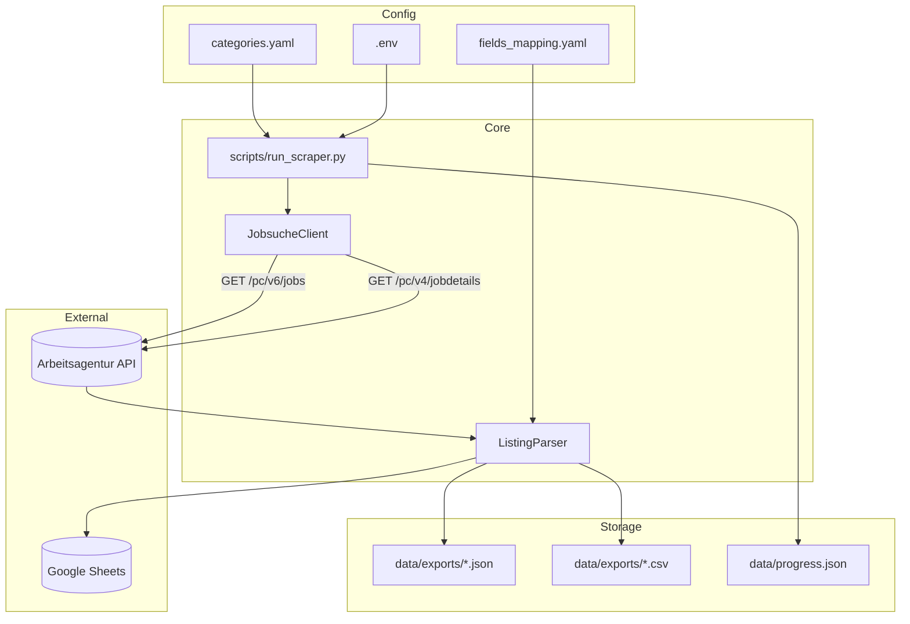
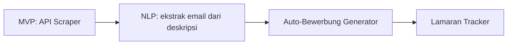

# Architecture

## Overview

Sistem menggunakan **Arbeitsagentur Jobsuche REST API** (bukan browser scraping) untuk mengumpulkan data Ausbildung.

## Komponen

| Modul | Path | Tanggung jawab |
|-------|------|----------------|
| API Client | `src/api_client/jobsuche.py` | Search + detail fetch, rate limiting |
| Parser | `src/parser/listing_parser.py` | Normalisasi API → `AusbildungListing` |
| Models | `src/models/listing.py` | Dataclass field output |
| Local Storage | `src/storage/local.py` | JSON/CSV export |
| Sheets | `src/storage/sheets.py` | Tab per kategori |
| Progress | `src/storage/progress.py` | Tracking & markdown export |

## Alur Data

1. **Search** — `GET /pc/v6/jobs?was=...&angebotsart=4` → daftar `referenznummer`
2. **Detail** — `GET /pc/v4/jobdetails/{base64(refnr)}` → deskripsi lengkap
3. **Parse** — Map ke 15+ field user + metadata
4. **Store** — JSON, CSV, Sheets, progress

## Keputusan Desain

| Keputusan | Alasan |
|-----------|--------|
| API over Playwright | Stabil, cepat, tidak butuh browser |
| Dataclass model | Type-safe, mudah di-serialize |
| Tab Sheets per kategori | Sesuai 3 profil pencarian user |
| Dedup kategori duplikat | URL #3 dan #4 identik |

## Roadmap Arsitektur

