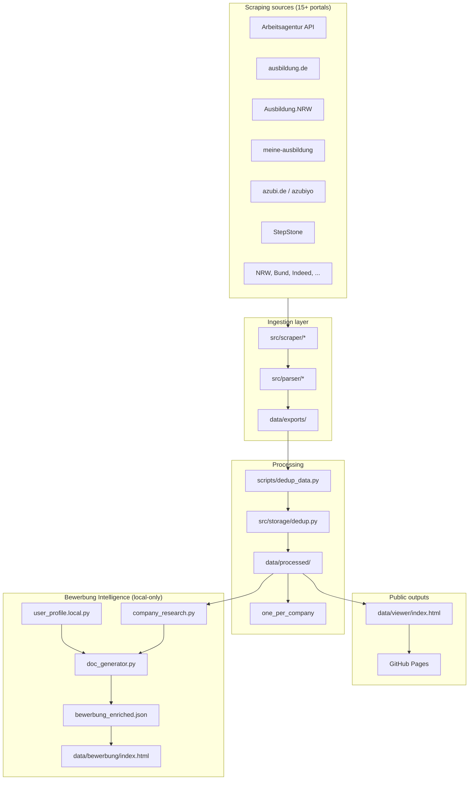
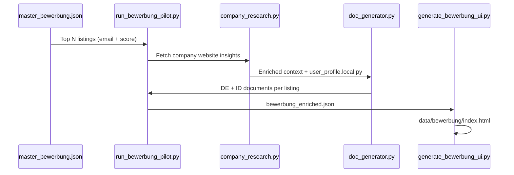

# Architecture — AusbildungHunter Intelligence

> **Tagline:** Multi-portal FI apprenticeship discovery, deduplication, and intelligent Bewerbung generation.

## System overview



## Tech stack

[](https://www.python.org/downloads/)
[](https://playwright.dev/)
[](../.github/workflows/pages.yml)
[](https://acimdamero.github.io/ausbildung-scraper/)

| Layer | Components |
|-------|------------|
| **Runtime** | Python 3.10+, stdlib (`json`, `csv`, `re`, `dataclasses`, `argparse`, `logging`, `pathlib`, `threading`) |
| **Ingestion** | `requests` + Arbeitsagentur Jobsuche API; Playwright/Chromium for JS-rendered portals; portal runners in `scripts/run_*.py` |
| **Parsing** | Per-portal parsers in `src/parser/`; JSON-LD extraction; regex HTML stripping; `AusbildungListing` dataclass |
| **Storage** | Local JSON/CSV (`src/storage/local.py`), dedup engine (`src/storage/dedup.py`), progress JSON, optional Google Sheets (`gspread`) |
| **Processing** | `dedup_data.py`, `export_one_per_company.py`, `generate_bewerbung_exports.py`; YAML config via `pyyaml` |
| **Presentation** | `generate_viewer.py` → embedded JSON in static HTML; vanilla JS filters + smart search; Bewerbung UI via `generate_bewerbung_ui.py` |
| **Bewerbung (local)** | `company_research.py`, `doc_generator.py`, `contact_extractor.py`, `user_profile.local.py` |
| **Deploy** | GitHub Actions `pages.yml` publishes `data/viewer/`; Bash orchestration (`run_background_pipeline.sh`, `watch_progress.sh`) |

**Dependencies** (`requirements.txt`): `requests`, `playwright`, `pyyaml`, `python-dotenv`, `gspread`, `google-auth`.

**Intentionally not used:** Selenium, BeautifulSoup — API-first where possible; Playwright only when a real browser is required.

## Repository layout

```
ausbildung-scraper/
├── README.md, README.de.md, README.id.md
├── LICENSE, CONTRIBUTING.md, .gitignore
├── config/
│   ├── categories.yaml          # FI search profiles (AE, AE 2026, DPA)
│   └── fields_mapping.yaml      # Normalized field definitions
├── docs/
│   ├── ARCHITECTURE.md          # This file
│   ├── PRIVACY.md, ACCESS.md
│   ├── github-pages-setup.md
│   └── *_SCRAPING.md            # Per-portal notes
├── scripts/
│   ├── run_scraper.py           # Arbeitsagentur API entry
│   ├── run_*.py                 # Portal-specific scrapers
│   ├── dedup_data.py            # Cross-source deduplication
│   ├── generate_viewer.py       # HTML job viewer
│   ├── generate_bewerbung_exports.py
│   ├── run_bewerbung_pilot.py
│   └── generate_bewerbung_ui.py
├── src/
│   ├── api_client/              # Jobsuche REST client
│   ├── scraper/                 # Portal fetchers (API + Playwright)
│   ├── parser/                  # Raw HTML/JSON → AusbildungListing
│   ├── models/                  # listing.py dataclass
│   ├── storage/                 # local, sheets, dedup, progress
│   └── bewerbung/               # Profile, research, doc generation
├── data/
│   ├── exports/                 # Raw scrape output (gitignored)
│   ├── processed/               # Deduped JSON/CSV
│   ├── viewer/                  # Public HTML viewer
│   ├── public/bewerbung-demo/   # Sample Bewerbung UI (no PII)
│   └── samples/                 # Small test outputs
└── .github/workflows/pages.yml  # GitHub Pages deploy
```

## Data model

Central type: `AusbildungListing` (`src/models/listing.py`)

| Field group | Examples |
|-------------|----------|
| Identity | `referenznummer`, `sumber_data` |
| Company | `firma`, `ort`, `strasse`, `plz` |
| Job | `titel`, `beschreibung`, `ausbildungsart` |
| Contact | `email_bewerbung`, `link_bewerbung`, `website` |
| Meta | `kategorie`, `scraped_at`, completeness flags |

## Deduplication strategy

1. **Primary key:** `referenznummer` when present (Arbeitsagentur)
2. **Secondary hash:** company + title + city + start date
3. **Category priority:** `ae_2026` > `dpa` > `ae`
4. **One-per-company:** `scripts/export_one_per_company.py` → best listing per `firma`

Output: `all_listings_deduped.json` (~6,850 listings) and `one_per_company.json` (~3,895 companies).

## Scraper types

| Type | Portals | Technology |
|------|---------|------------|
| REST API | Arbeitsagentur | `requests`, public API key |
| JSON-LD / DOM | ausbildung.de, azubiyo | Playwright Chromium |
| HTML pagination | StepStone, Indeed, meinestadt | Playwright + anti-bot delays |
| Portal-specific | NRW, Bund, karriere-suedwestfalen | Custom parsers in `src/parser/` |

Common runner utilities: `scripts/portal_scrape_common.py`

## Bewerbung Intelligence pipeline



**Privacy boundary:** Everything after `user_profile.local.py` is local-only and gitignored.

## Configuration

| File | Purpose |
|------|---------|
| `.env` | API delays, workers, optional Google Sheets |
| `config/categories.yaml` | Search queries for FI profiles |
| `user_profile.local.py` | Private applicant data |

## Design decisions

| Decision | Rationale |
|----------|-----------|
| API-first for Arbeitsagentur | Stable, fast, no browser |
| Playwright for dynamic sites | Required for JS-rendered listings |
| Embedded JSON in HTML viewer | Zero backend; works on GitHub Pages |
| Local-only Bewerbung output | GDPR / personal data protection |
| Monorepo scrapers + bewerbung | Single deduped dataset feeds both flows |

## Extension points

- Add portal: `src/scraper/new_portal.py` + `src/parser/new_portal_parser.py` + `scripts/run_new_portal.py`
- NLP email extraction from descriptions (roadmap)
- Gmail API send tracking (roadmap — manual send only today)

## Related docs

- [DATA_PIPELINE.md](DATA_PIPELINE.md) — scrape → export flow
- [BEWERBUNG_SYSTEM.md](BEWERBUNG_SYSTEM.md) — document generation
- [PRIVACY.md](PRIVACY.md) — public vs private data
